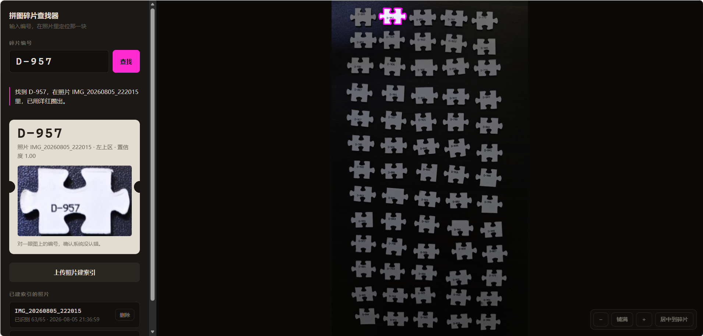

# 拼图碎片编号查找器

**在几百块摊开的拼图碎片里，一秒钟找到指定编号的那一块。**

有些拼图每块背面都印着编号（`B-403`）。拼的时候想找某一块，只能趴在桌上
一块块翻——几百块碎片，找一块要几分钟，而且刚翻过的地方转头就忘了。

这个工具的做法是：把碎片摊在深色桌布上拍张照，上传建索引；之后在手机上
输入编号，照片里那一块会被高亮出来，周围压暗但仍然看得见。

**关键在于最后半句。** 目标不是「在屏幕上标出碎片」，而是**让你的手能在
桌上找到它**——所以周围不能压黑，你需要靠邻近碎片的排布、桌布纹理、桌沿
来把屏幕上的位置映射回真实桌面。屏幕只是中介。

全本地运行：OpenCV 分割 + PaddleOCR 识别。不联网、不调用任何大模型、
无使用成本。



*查到 `D-957`：目标碎片保持原亮度并用洋红描边，其余压暗到 45%。**压暗而不压黑是刻意的**——
周围碎片的排布、桌布纹理、桌沿，是你把屏幕上的位置对回桌面的唯一参照，压黑了就只知道
「它在这儿」而不知道「这儿是哪儿」。左边的缩略图供你对一眼编号，确认系统没认错。*

---

## 效果

一张 50 块的实拍照片（深色背景，1086×1448）：

| 指标 | 结果 |
| --- | --- |
| 分割 | **50 / 50**，零偏差 |
| 识别 | **50 / 50（100%）** |
| 耗时 | **7.2 秒**（0.144 秒/块） |
| 其中直接读出 | 39 块；另外 11 块靠旋转穷举救回 |

跑在一块 RTX 3050 Laptop（4 GB）上。同一张照片用 CPU 跑是 246.4 秒，
**GPU 快 34 倍，而 50 个编号逐条相同**——纯提速，没有精度代价。

> **识别率几乎完全由照片质量决定，调参救不回来。** 上面这个 100% 的前提是
> 照片满足下面「拍照要求」那几条。不满足时掉到什么程度都可能，
> 这不是工具的问题，是输入的问题。

---

## 运行环境

- **必须有 NVIDIA 显卡**，驱动支持 CUDA 12.6 以上（`nvidia-smi` 右上角那个数字）
- Windows，Python 3.13+
- 显存约 155 MB，4 GB 的卡绰绰有余

本项目只支持 GPU。没有显卡的话技术上能改回 CPU 版 paddle 跑，但慢 34 倍
（一张 50 块的照片要等四分钟），实际上不好用。

---

## 安装

```powershell
git clone <这个仓库>
cd puzzle-piece-finder

python -m venv .venv
.\.venv\Scripts\python.exe -m pip install -e ".[dev]"

# paddlepaddle 要单独装，且必须换源。CUDA 运行时和 cuDNN 是它的 pip
# 依赖会一并拉下来，不必自己装 CUDA Toolkit。约 1.9 GB。
.\.venv\Scripts\python.exe -m pip install paddlepaddle-gpu==3.3.1 `
  -i https://www.paddlepaddle.org.cn/packages/stable/cu130/
```

驱动是 CUDA 13.x 用 `cu130`，12.x 换成 `cu129` / `cu126`。

> **依赖装在项目自带的 `.venv` 里，别装进 base 环境。** PaddleOCR 会拉进
> `opencv-contrib-python`，装进 base 会顶掉已有的 headless OpenCV。
>
> **`paddlepaddle` 故意没写进 `pyproject.toml`。** 它和 `paddlepaddle-gpu`
> 是两个发行名却抢同一个 `paddle` 包目录，写进去的话重跑一次
> `pip install -e .` 会把 CPU 版装回来，34 倍的提速就这么没了，还不报错。
> 分开之后装漏了会当场 `ImportError`——响亮的失败好过安静的退化。

首次识别会自动下载模型（约 139 MB，缓存在用户目录的 `.paddlex` 下），只下一次。

---

## 启动

**在 VS Code 里打开 [`main.py`](main.py) 点运行**，或者：

```powershell
python main.py
```

它会自己切到 `.venv` 的解释器（编辑器选中哪个都行），并挑一个没人在听的
端口（默认 8791，被占就往上顺延），然后打印两个地址：

- 电脑：`http://127.0.0.1:8791`
- 手机：同一个 Wi-Fi 下用它打印的那个局域网地址

---

## 用法

### 建索引

三条路，底下的引擎完全一样：

```powershell
# 1. 网页上传（手机上点「上传照片」可以现拍，也可以从相册选）

# 2. 命令行
.\.venv\Scripts\python.exe -m puzzlefind.cli index data\photos\桌面1.jpg --index-dir data\index

# 3. 标定脚本：额外输出每一步的中间图，排查用
.\.venv\Scripts\python.exe scripts\calibrate.py data\photos\桌面1.jpg
```

> **网页上传会先问「这张拍的是哪片区域」**，你填的名字就是 `photo_id`，
> 也是查询结果里显示的那个名字。选一个**已有的名字**即为重拍替换——那份
> 索引被整个覆盖，这就是碎片被拿走之后刷新索引的方式。
>
> **名字只能在网页上问，没法从文件名里取。** 手机相册交给浏览器的文件名是
> 点选那一刻现造的毫秒时间戳（`1786177906346.jpg`），你在手机上改的名字
> 从来没进过上传请求。
>
> 命令行用 `--photo-id` 指定；不给时取自文件名去掉最后一个扩展名，
> 所以 `桌面.jpg.jpg` 会得到 `photo_id` = `桌面.jpg`。

### 查询

```powershell
.\.venv\Scripts\python.exe -m puzzlefind.cli query D-794 --index-dir data\index
.\.venv\Scripts\python.exe -m puzzlefind.cli stats --index-dir data\index
```

`--index-dir` 要放在**子命令之后**。命中退出码 0，未命中 1。

**未命中时不会只说「没找到」**——它会列出那张照片里所有**未识别**的碎片，
把搜索范围从几百块塌缩到个位数（网页上用青色圈出）。因为「没找到」这句话
零信息量：这块可能根本不在照片里，也可能就在桌上只是没认出来，
而这两种情况你该做的事完全相反。

---

## 拍照要求（决定成败的一步）

| 要求 | 为什么 | 不满足时会怎样 |
| --- | --- | --- |
| **纯深色、无花纹背景** | 前景分离退化成一次阈值操作 | 蓝白格子毯上，米白格子与碎片同色，2/3 的碎片直接消失，斜纹还炸出几百个假轮廓 |
| **一张 40–60 块** | 决定每个字符占多少像素 | 一张塞 85 块以上，字太小读不出 |
| **摊开留缝，别互相压着** | 粘连的碎片会被当成一块 | 40 块粘成 14 个连通块，一张裁剪图里两个编号只返回一个 |
| **导出别缩图** | 同上 | 缩到 900 px 宽后字符只剩 12 px，肉眼都读不全 |
| **编号尽量朝正** | 朝正的一次读出，歪的要进角度穷举 | 只影响速度，不影响识别率 |

**自查方法**：跑一次 `scripts/calibrate.py`，打开 `debug/<照片名>/crops/` 里的图——
**编号必须清晰可读，且一张图里只有一个编号。** 这一条过了，其余基本都会过。

`calibrate.py` 还会输出每一步的中间图：

| 文件 | 看什么 |
| --- | --- |
| `01_mask.png` | 碎片是干净白团、背景是纯黑？背景有大片白说明不够深 |
| `02_blobs.png` | 黄轮廓贴合碎片（多块被圈成一个是正常的，下一步会切） |
| `03_split.png` | **洋红轮廓的数量应等于实际碎片数**，这是分割质量的硬指标 |
| `crops/*.png` | **最关键**：编号清晰吗？有没有混进邻块的编号？ |
| `04_unrecognized.png` | 青色圈出没认出来的，看它们有什么共同点 |
| `index.json` | 每块碎片读成了什么，可直接打开看 |

---

## 已知限制

- **前缀读错能发现，但通常纠正不了。** 编号区间确定之后 `A-403` 不再是合法
  编号（403 属于 B 段），所以前缀误读**一定会被检出**——实测 3000 种可能的
  前缀误读没有一种会被静默收下。但检出不等于可纠正：`A-403` 有三个等距解释
  （`B-403` 前缀错，或 `A-103`/`A-203` 百位错），无从选择，只能判为未识别。
  失败模式从「悄悄读成另一个合法编号」变成了「明确的读不出」，后者由
  「查不到时高亮全部未识别碎片」兜住。
- **`A-1`～`A-99` 这 99 块享受不到上面那道校验。** 一位和两位的数字全部落在
  A 段内部，任何数字误读仍然合法（`A-42` 读成 `A-47` 无从发现）。它们的
  字符还最少、最容易读错。位数增减倒是能抓到（`A-42` 读成 `A-421` 落进 B 段）。
- **索引是静态的。** 拿走碎片后需要重拍那张照片刷新。分块拍照就是为了让这件事
  足够便宜。
- 只认背面编号，**不识别正面图案，不自动解拼图**。

---

## 排障

| 现象 | 真因 |
| --- | --- |
| `No available model hosting platforms detected.` | paddlex 探测下载源只给 1 秒超时，站点其实都通只是没那么快。代码已跳过该探测并把国内源排到第一位 |
| 手机连不上打印出来的地址 | 代理软件（Clash 等）的 TUN 网卡接管默认路由，经典的「连 8.8.8.8 看本地端点」会返回 `198.18.0.0`。代码已改为遍历所有网卡并按网段优先级排序 |
| 服务起来了但请求落到别的应用 | 端口被占，而 Windows 允许重复绑定不报错。`main.py` 会用 connect 探测避开这个坑 |

---

## 项目结构

```
main.py            一键启动（切解释器 + 挑端口 + 起服务）
puzzlefind/
  config.py        所有可调参数集中在这里
  vocabulary.py    编号词表（1000 个）、校验、归一化、形近字符吸附
  segment.py       掩膜、轮廓提取、粘连切分、裁剪
  recognize.py     OcrBackend 协议、PaddleOCR 后端、多级降级识别
  resolve.py       同图唯一性消解
  models.py        Piece / PhotoIndex 及 JSON 序列化
  pipeline.py      串起分割 → 识别 → 消解
  library.py       多照片库、跨照片查询
  render.py        高亮渲染（压暗 + 描边）与缩略图
  cli.py           命令行入口
  server.py        FastAPI 服务
  static/          单文件前端
scripts/
  calibrate.py     标定：输出每一步的中间图
  benchmark.py     建索引耗时基准
  probe_paddleocr.py  探明 PaddleOCR 的返回结构（升级版本后用）
```

**架构上唯一需要知道的事**：`recognize.OcrBackend` 是一个 `Protocol`，
PaddleOCR 只是它的一个实现。除少数标记为 `@pytest.mark.ocr` 的集成测试外，
所有测试注入假后端，**完全不加载 PaddleOCR**——所以测试几秒钟跑完，也不依赖
模型下载。换识别后端只需实现 `read(image) -> list[RawDetection]`。

---

## 测试

```powershell
.\.venv\Scripts\python.exe -m pytest tests\ -m "not ocr"   # 快，不碰模型
.\.venv\Scripts\python.exe -m pytest tests\                # 含 OCR 集成测试
```

---

## 调参

所有可调参数集中在 [`puzzlefind/config.py`](puzzlefind/config.py) 一个文件里，
每个都写着它为什么是现在这个值。

**换一套拼图先改 `CODE_RANGES`。** 那里写死的是本套拼图的编号区间
（A 为 1–260，B 为 261–520，C 为 521–760，D 为 761–1000，数字不补零）。
识别的准确性重度依赖它——数字唯一确定前缀这条性质就是从这里来的，
填错了会把正确读数判成非法编号。

**改参数之前先确认照片没问题。** 排查顺序是**裁剪出的字号 → 背景 → 切分参数**，
别跳步——绝大多数「识别不出来」的根因在前两步，改切分参数只会把问题掩盖掉。

---

## 设计说明

[docs/design.md](docs/design.md) 记录**为什么**这么做：为什么不用视觉大模型、
为什么要求深色背景、为什么一张只拍 40–60 块、旋转怎么处理、
编号区间为什么让前缀变成一位校验码，以及每一处被否决的替代方案。

---

## License

[MIT](LICENSE)
